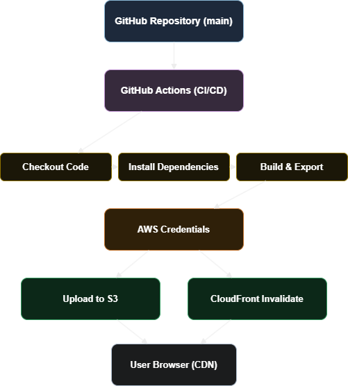

### [S3 배포 링크](http://soominss-buket.s3-website.ap-northeast-2.amazonaws.com/)

### [CloudeFront 배포 링크](https://d3jxcj7xvwc1i5.cloudfront.net)

---

# 기본 과제

## 사용 기술

- **Next.js**: 정적 페이지 생성 프레임워크
- **Yarn**: 패키지 매니저 (yarn install, yarn build 사용)
- **GitHub Actions**: 자동화된 워크플로우 실행
- **AWS S3**: 정적 파일 업로드 대상
- **AWS CloudFront**: CDN을 통한 글로벌 캐싱 및 배포
- **IAM / GitHub Secrets**: 자격 정보 관리

---

## 배포 흐름

1. main 브랜치에 코드가 푸시되거나 수동으로 워크플로우 실행
2. [.github/workflows/deployment.yml](./.github/workflows/deployment.yml)에 정의된 작업 실행
3. yarn install로 의존성 설치 → yarn build로 정적 파일 생성
4. out/ 디렉토리를 S3 버킷에 업로드
5. CloudFront 캐시를 무효화하여 최신 콘텐츠 반영

---

## 아키텍처 다이어그램

---

## 정리

- GitHub Actions로 자동 배포 파이프라인 구축
- 정적 파일을 S3에 업로드 후 CloudFront로 제공
- 캐시 무효화를 통해 실시간 콘텐츠 반영 처리
- 배포에 필요한 자격 정보는 GitHub Secrets에 저장
- 전체 빌드 및 배포 과정은 yarn 명령어 기반으로 구성

---

# 심화 과제

<!-- 측정표 -->
## 📊 S3 vs CloudFront Lighthouse 비교
> 아래 표는 **최신 배포 시마다 자동으로 업데이트**됩니다.
> (업데이트: 2025-05-26 17:33 KST)

| 항목 | S3 | CloudFront |
|------|------------------|--------------------|
| Performance | 🟨 61 | 🟩 100 |
| Accessibility | 🟩 100 | 🟩 100 |
| Best Practices | 🟩 92 | 🟩 100 |
| SEO | 🟩 100 | 🟩 100 |
| PWA | 🟥 33 | 🟥 33 |
| FCP | 2257.9271500000004 ms (2.3s) | 1182.721 ms (1.2s) |
| LCP | 3442.04525 ms (3.4s) | 1182.721 ms (1.2s) |
| Speed Index | 5505.529879719812 ms (5.5s) | 2071.820892000047 ms (2.1s) |
| TTI | 7271.899549999999 ms (7.3s) | 2081.721 ms (2.1s) |
| TBT | 1097.595475 ms (1.1s) | 25.5 ms (0.0s) |
| CLS | 0.03219778382211097 | 0.04571302421445905 |
| TTFB | 0 ms (0.0s) | 404.63800000000003 ms (0.4s) |
| Total Requests | 19 | 17 |
| Total Transfer Size | 397321 bytes (0.38MB) | 164488 bytes (0.16MB) |
<!-- end -->

> - **FCP/LCP/Speed Index/TTI**: 페이지 렌더링 및 반응속도를 보여주는 지표 (낮을수록 빠름)
> - **TBT**: 사용자가 입력할 때 대기해야 하는 총 시간 (낮을수록 쾌적)
> - **CLS**: 페이지가 갑자기 움직이는 현상 정도 (0~0.1이면 매우 우수)
> - **TTFB**: 서버 응답의 초기속도 (ms, 낮을수록 빠름)
> - **Total Requests/Size**: 요청 수와 전체 다운로드 크기 (적을수록 가벼움)
> - **참고:**
>   - S3 정적 웹호스팅은 서버 타이밍 정보를 제공하지 않아, Lighthouse 등 일부 도구에서는 TTFB(Time To First Byte)가 0ms 또는 N/A로 표시될 수 있음
>   - 실제 TTFB는 네트워크 환경과 AWS 리전, 사용자 위치에 따라 수십~수백 ms일 수 있음
>   - 정확한 TTFB 측정이 필요하다면 브라우저 개발자도구, curl, WebPageTest, Pingdom 등의 별도 네트워크 도구를 활용

- CloudFront가 거의 모든 주요 성능 지표에서 S3보다 우수하게 나타남
- 특히, FCP(First Contentful Paint), LCP(Largest Contentful Paint), TTI(Time to Interactive) 등 사용자 체감에 직접적으로 연결되는 항목에서 큰 차이를 보인다.

 

### 네트워크 응답 시간 (크롬 개발자도구 캡처)

정적 웹사이트의 첫 요청에 대해 크롬 개발자 도구에서 측정한 Request/Response 단계별 소요 시간을 S3와 CloudFront 각각 캡처해 비교

| 항목                      | S3        | CloudFront |
|--------------------------|-----------|------------|
| Request sent             | 0.20 ms   | 0.12 ms    |
| Waiting for server response (TTFB) | 38.60 ms | 8.13 ms |
| Content Download         | 0.51 ms   | 2.58 ms    |
| **총 소요 시간**         | 61.70 ms  | 25.71 ms   |

- CloudFront가 S3보다 Waiting for server response(TTFB)가 더 짧게 나타난다
- CloudFront는 전 세계에 분산된 엣지 캐시(Edge Cache)를 활용해 최초 응답까지의 시간을 줄일 수 있다
- S3 직접 접근은 단일 리전 한계로 인해 대기 시간이 상대적으로 길어질 수 있다
- 실제 서비스에서는 요청이 많아질수록, 다양한 지역에서 접속할수록 CloudFront의 성능 이점이 더 크게 나타난다

#### S3 네트워크 캡처

#### CloudFront 네트워크 캡처

---

## 2. 비교 분석

### 2.1 성능

- CloudFront는 CDN의 장점을 살려 응답 시간과 주요 웹 퍼포먼스 지표에서 S3보다 항상 더 나은 결과를 보여준다
- S3는 단일 리전에 위치한 스토리지이기 때문에 네트워크 레이턴시가 더 크고, 사용자와의 거리만큼 속도 저하가 발생할 수 있다
- CloudFront는 정적 파일을 전 세계 엣지(POPs)에서 제공하여 물리적 거리를 극복할 수 있다

### 2.2 네트워크 효율

- CloudFront를 사용하면 총 전송 용량, 리소스 요청 수 등도 줄어드는 효과가 있다
- 요청이 반복되거나 많은 사용자가 동시에 접근할수록 캐시 효율이 극대화된다

### 2.3 사용자 경험

- CloudFront는 FCP, LCP, TTI 등 사용자가 웹사이트를 빠르게 체감할 수 있도록 돕는다
- S3만 사용할 경우, 해외 또는 모바일 환경에서 첫 화면이 뜨는 속도가 느려질 수 있다

### 2.4 운영 및 확장성

- 트래픽이 적은 소규모 서비스는 S3 단독 배포만으로도 충분하다
- 글로벌, 대규모 트래픽, 빠른 응답과 확장성이 필요한 서비스는 반드시 CloudFront 같은 CDN 활용이 필요하다
- CloudFront는 SSL, 커스텀 도메인, 압축, 보안, 캐시 무효화 등 다양한 부가 기능도 제공한다

---

## 3. 결론

